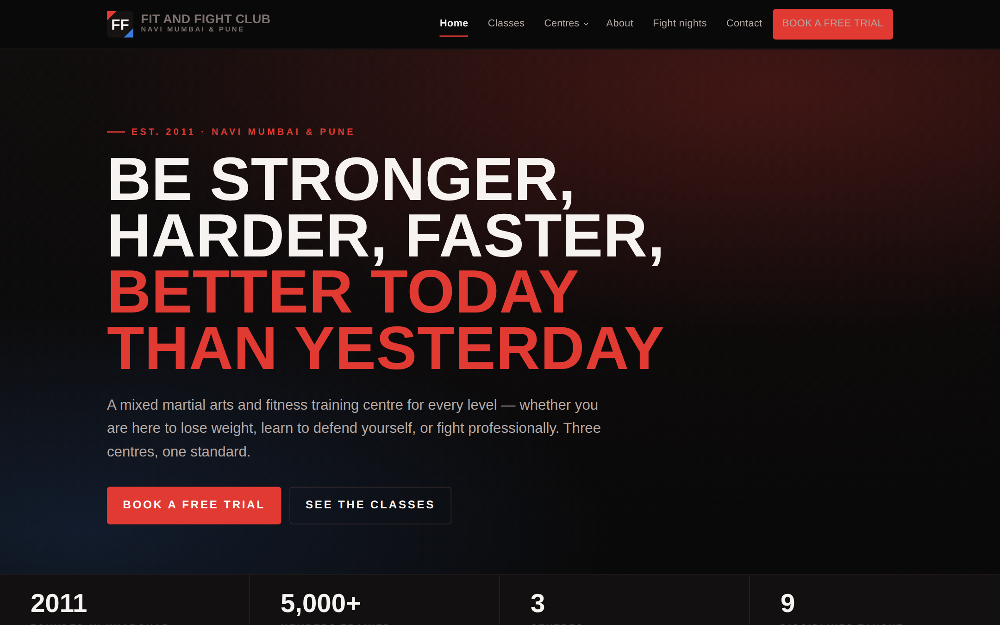
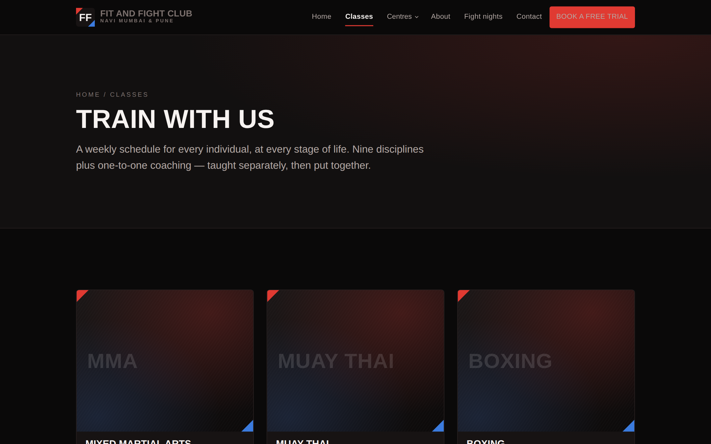
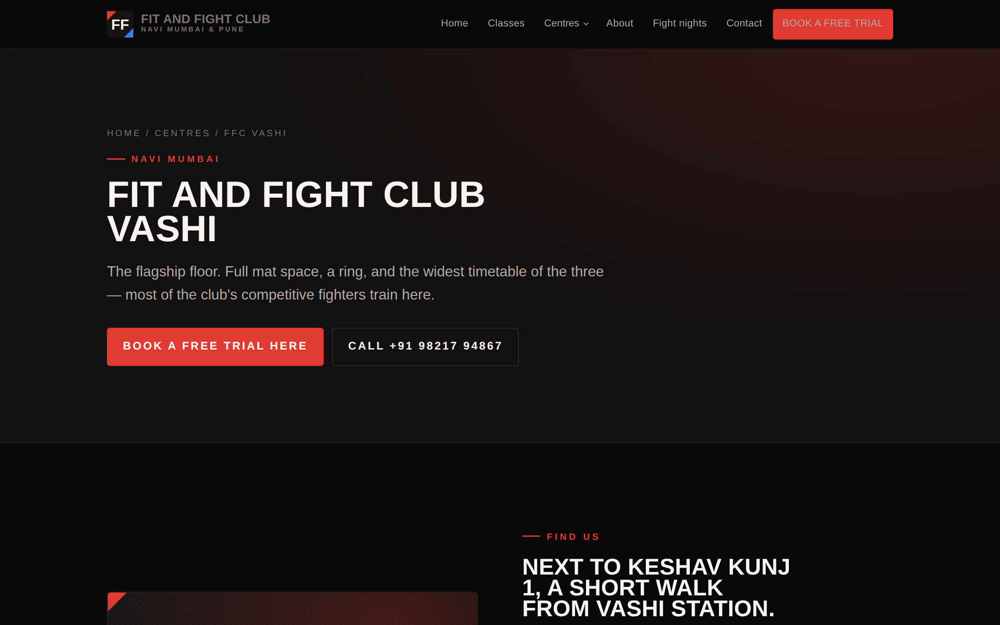

# Fit and Fight Club — website

A static rebuild of [fitandfightclub.com](https://www.fitandfightclub.com/) — the mixed martial arts
and fitness club founded in 2011, now running three centres: **Vashi** and **Nerul** in Navi Mumbai,
and **Wagholi** in Pune.

Seven pages, no build step, no dependencies, no backend. Every centre gets its own page, its own
address and phone number, and its own free-trial form.



---

## Contents

- [What's here](#whats-here)
- [Running it](#running-it)
- [Deploying to GitHub Pages](#deploying-to-github-pages)
- [Project structure](#project-structure)
- [Before you go live](#before-you-go-live)
- [The hero image](#the-hero-image)
- [Replacing the remaining placeholder images](#replacing-the-remaining-placeholder-images)
- [How the enquiry form works](#how-the-enquiry-form-works)
- [Design notes](#design-notes)
- [Editing content](#editing-content)

---

## What's here

| Page | Path | What it does |
|------|------|--------------|
| Home | `/` | The slogan, the three ways in, the three centres, the core team, fight nights |
| Classes | `/classes/` | All nine disciplines plus personal training, and how a first class works |
| About | `/about/` | The story from Kharghar 2011 to three centres, coaching philosophy, the team |
| FFC Vashi | `/vashi/` | Address, manager, map, what's taught there, its own trial form |
| FFC Nerul | `/nerul/` | Same, for Nerul East |
| FFC Wagholi | `/wagholi/` | Same, for Pune |
| Contact | `/contact/` | All three centres side by side, socials, and the trial form |
| Not found | `/404.html` | Self-contained 404 for GitHub Pages |

Each centre page carries its own `SportsActivityLocation` structured data with the real address and
phone number, so Google can list the three centres separately in local results.



---

## Running it

Nothing to install. Open `index.html` directly, or serve the folder so that the clean URLs
(`/classes/` rather than `/classes/index.html`) behave the way they will in production:

```bash
git clone https://github.com/<your-username>/fitandfightclub.git
cd fitandfightclub
python3 -m http.server 8080
# visit http://localhost:8080
```

---

## Deploying to GitHub Pages

`.github/workflows/deploy-pages.yml` publishes the site on every push to `main`.

1. Push this repo to GitHub.
2. **Settings → Pages → Build and deployment → Source → GitHub Actions.**
3. Push to `main`. The site goes live at `https://<your-username>.github.io/fitandfightclub/`.

**For the real domain**, add a file called `CNAME` at the repo root containing one line —
`www.fitandfightclub.com` — and point a DNS `CNAME` record at `<your-username>.github.io`. Then
update the host in `sitemap.xml` and `robots.txt` if you are using anything different.

> Note: `404.html` links to `/`, which is correct on a custom domain. On a project URL
> (`username.github.io/fitandfightclub/`) change that link to the full project path.

---

## Project structure

```
fitandfightclub/
├── index.html              Home
├── classes/index.html      All nine disciplines
├── about/index.html        Story, philosophy, team
├── vashi/index.html        ┐
├── nerul/index.html        ├ one page per centre
├── wagholi/index.html      ┘
├── contact/index.html      All centres + enquiry form
├── 404.html                Self-contained, no external assets
├── robots.txt, sitemap.xml
├── assets/
│   ├── favicon.svg
│   ├── css/styles.css      Every token and component, one file
│   ├── js/site.js          Menu, dropdown, scroll reveal, WhatsApp form
│   └── img/                Hero photo + placeholder artwork — see below
├── docs/                   README screenshots
└── tools/build.py          Optional page generator (see "Editing content")
```

The header and footer are the **same block of HTML in all seven pages**, each marked with a
`<!-- HEADER — identical on every page -->` comment. Change one, change all seven — or use the
generator in `tools/`.

---

## Before you go live

This is a faithful rebuild of the structure and content of the live site, but a few things are
deliberately marked for you to fill in. Search the repo for each:

1. **Photography.** The home hero now uses a real photo from your Wix media library (see below);
   every other image is still a generated placeholder.
2. **Class timings.** The live site does not publish a timetable, so neither does this one — each
   centre page says "call the centre for this week's timetable" instead of inventing hours. If you
   want real timetables on the page, add them per centre page.
3. **Fight record board** (`index.html`, "Our coaches' wins"). Three generic lines are in place with
   a visible note telling you to replace them. Put your actual results there or delete the panel.
4. **Email address.** None is published on the live site, so the forms use phone and WhatsApp only.
   If you have a club email, add it to the contact page and the footer.
5. **The About page on the live site is out of date** — it still says two branches, Seawoods and
   Vashi. This rebuild uses the current three (Vashi, Nerul, Wagholi) and describes Seawoods as part
   of the history. Confirm that is right before publishing.
6. **Nerul contacts.** The live site lists Ashok Bagade as the centre manager but gives Rahul
   Khadpe's number for enquiries. Both appear on `/nerul/` — adjust if that is not intended.
7. **Prices.** No pricing appears anywhere, matching the live site. Add a pricing section if you
   want people to self-qualify before calling.

---

## The hero image

The home-page hero uses a real photograph from the club's Wix media library, requested at full size:

```
https://static.wixstatic.com/media/7975cd_…f000.jpg
  /v1/fill/w_1920,h_1080,al_c,q_85,usm_0.66_1.00_0.01,enc_auto/7975cd_…f000.jpg
```

**A warning about Wix URLs.** Everything between `/v1/fill/` and the trailing filename is a
transform instruction, not part of the file. The URL copied out of a browser's inspector is usually
the *placeholder* Wix loads first — `w_138,h_77` at `blur_2`. Stretched across a hero that renders
as a smear. This site requests `w_1920,h_1080`, no blur, `enc_auto` so the browser negotiates the
format, and quality 85. Change the numbers to change the render; the media ID stays the same.

**Self-host it.** Right now the site depends on Wix staying up and continuing to serve that file —
if the Wix subscription lapses, the hero goes with it. Download it once:

```bash
curl -L -o assets/img/hero.jpg \
  "https://static.wixstatic.com/media/7975cd_f3459382a53949359d847b8624edc8f8f000.jpg/v1/fill/w_1920,h_1080,al_c,q_85,usm_0.66_1.00_0.01,enc_auto/7975cd_f3459382a53949359d847b8624edc8f8f000.jpg"
```

Then set `HERO_IMG = "assets/img/hero.jpg"` in `tools/build.py` and re-run it, or just edit the
`src` in `index.html` by hand. The preconnect to `static.wixstatic.com` drops out automatically once
the path is local.

**It is a video frame.** The `f000` suffix on that filename is Wix's convention for frame zero of a
video — on the live site this sits behind a `<wix-video>`. If you want the motion as well as the
still, replace the `` in `.hero-media` with a muted autoplaying `<video>` and keep this image as
its `poster`.

If the image cannot be fetched for any reason, an `onerror` handler swaps in
`assets/img/hero.svg` so the hero never renders blank.

---

## Replacing the remaining placeholder images

Every other `assets/img/*.svg` is a generated dark panel, sized to the aspect ratio the layout
expects. Drop in a real photo and point the `src` at it — nothing else needs to change.

| File | Used on | Aspect | Suggested shot |
|------|---------|--------|----------------|
| `about.svg` | About page | ~3:2 | Team photo, or the original Kharghar room |
| `centre-vashi.svg` etc. | Home, centre pages | 16:10 | The actual floor at each centre |
| `disc-*.svg` (9) | Classes page | 5:4 | One shot per discipline — pads, mats, ring |
| `coach-*.svg` (4) | Home, About | 1:1 | Head-and-shoulders, dark background |

Use JPEGs around 1600px wide for the hero and 1000px for the tiles, keep them under ~250KB each,
and keep the `width`/`height` attributes on the `` tags so the page does not jump while
loading. Every image below the fold is already `loading="lazy"`.

**Social preview:** the pages carry Open Graph tags but no `og:image`, because SVG previews do not
render on most platforms. Once you add a real hero JPEG, add
`<meta property="og:image" content="https://www.fitandfightclub.com/assets/img/hero.jpg">` to each
page's `<head>`.



---

## How the enquiry form works

There is no server, so the form does not POST anywhere. On submit it composes a WhatsApp message —
name, phone, discipline, experience level — and opens `wa.me` addressed to the chosen centre's
number. On a centre page that centre is pre-selected.

Nothing is stored on the site, which also means there is nothing to secure and no privacy policy to
write. The trade-off is that you have no record of enquiries that never reach WhatsApp.

If you later want proper lead capture, swap the `submit` handler in `assets/js/site.js` for a POST
to Formspree, Getform or your own endpoint — the form fields are already named
(`name`, `phone`, `centre`, `interest`, `experience`, `message`).

---

## Design notes

**Colour** comes from the corners of a fight: red corner (`#E03A32`) as the house accent, blue
corner (`#3B7BDE`) as its answer, and gold kept for things that were actually won. The neutrals are
warm gunmetal rather than plain grey. Every token sits at the top of `assets/css/styles.css`.

**Two devices recur.** `.ropes` — three hairlines, the middle one red — is the rule between
sections. `.corner` cuts a red triangle into a panel's top-left and a blue one into its
bottom-right. The favicon and header mark use the same pair.

**Type** is Big Shoulders Display for headings, Barlow for body, Barlow Condensed for the small
uppercase labels, all from Google Fonts. Barlow Condensed sits second in the display stack on
purpose: if the display face fails to load, headlines still fall back to something condensed rather
than sprawling across extra lines.

The site is **dark only**, by choice rather than omission — so every colour is painted explicitly
and nothing is inherited. Motion is a single scroll reveal, and `prefers-reduced-motion` turns it
off entirely.

> The screenshots in this README were captured in an offline environment where Google Fonts could
> not load, so headings show a fallback face. The live site uses Big Shoulders Display.

---

## Editing content

For small changes, edit the HTML directly — it is plain and readable.

For anything that touches the header, footer or a repeated block, `tools/build.py` regenerates all
seven pages from one place. All the content — branches, coaches, disciplines, addresses, phone
numbers — is declared as Python lists at the top of that file:

```bash
python3 tools/build.py     # rewrites the seven HTML files
```

It needs nothing but Python 3. If you would rather not use it, delete `tools/` — the site does not
depend on it in any way.

---

Built for Fit and Fight Club. *Be stronger, harder, faster, better today than yesterday.*
